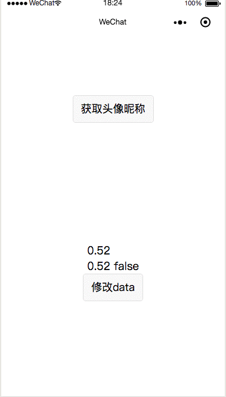
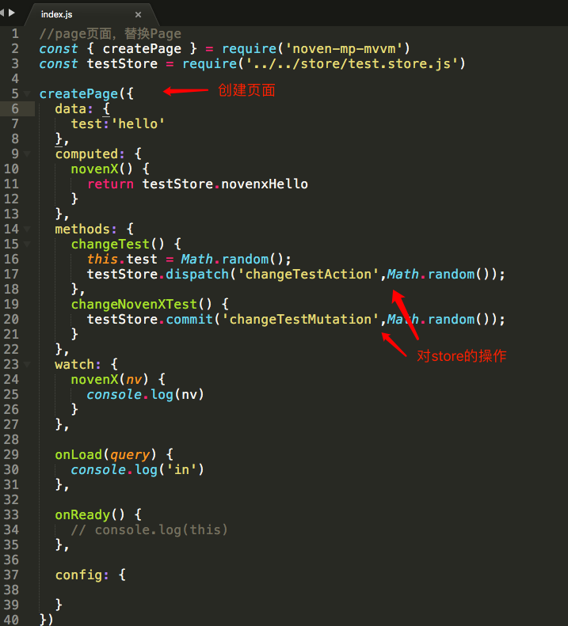
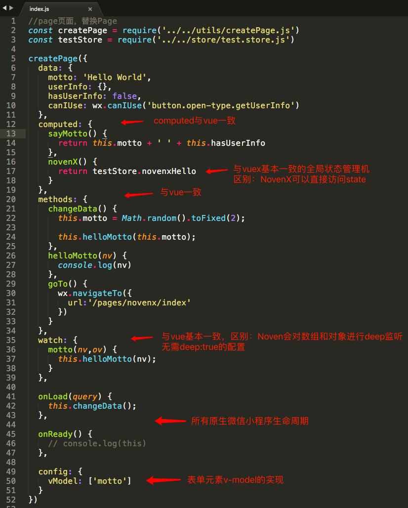
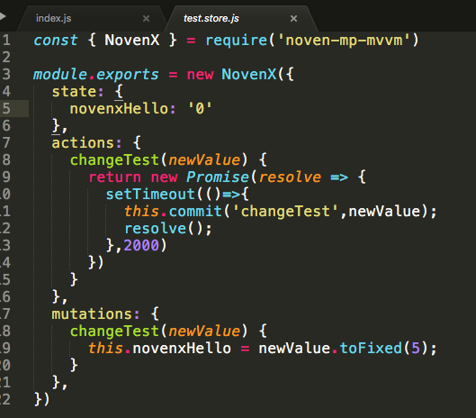

# noven-simple-mp-mvvm
**Noven-mp-mvvm  一个简洁的双向数据绑定的原生小程序mvvm框架**

与mpvue等框架的区别是：

本框架是**增强型框架**（只增强原生小程序的功能），非编译型框架


实现的核心功能：

1. **小程序data中的数据变化，自动调用this.setData**，实现双向数据绑定

2. 实现表单元素的v-model功能

3. 实现与vuex一致的全局状态管理机-NovenX

4. 与vue基本一致的数据操作

5. ...

   
  
  **本项目是noven-mp-mvvm框架应用的展示demo：**
  
  


示例如下：




同时有与Vue体验一致的computed，watch，methods，vuex等


## Noven-mp-mvvm使用方法

### 1、获取代码

```
npm install noven-mp-mvvm -S
```

或

```
1、git clone https://github.com/a290079770/noven-simple-mp-mvvm.git
2、找到utils/noven.js、util/createPage.js、util/novenX.js
3、三个核心文件放入项目
```


## 2、使用

正常创建小程序页面文件.wxml、.wxss、.json、.js

#### 2.1、使用npm包




#### 2.2、使用utils下的文件




#### 2.3、store的创建



store的核心操作方法：

```
xxxStore.dispatch('xxAction',params)
xxxStore.commit('xxMutation',params)

其他概念见vuex
```


#### data、computed、watch、methods、novenX开发体验与Vue一致

具体用法参考Vue文档，<https://cn.vuejs.org/>

